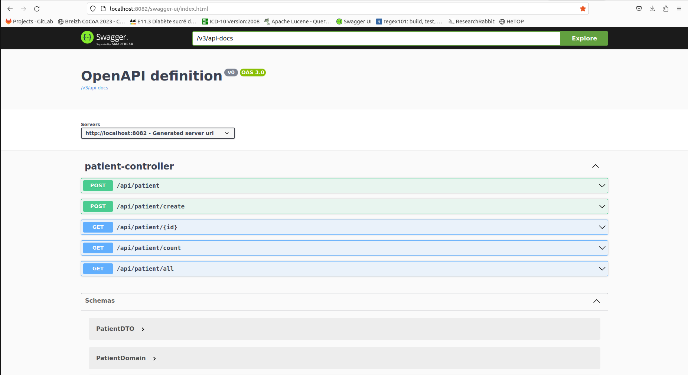
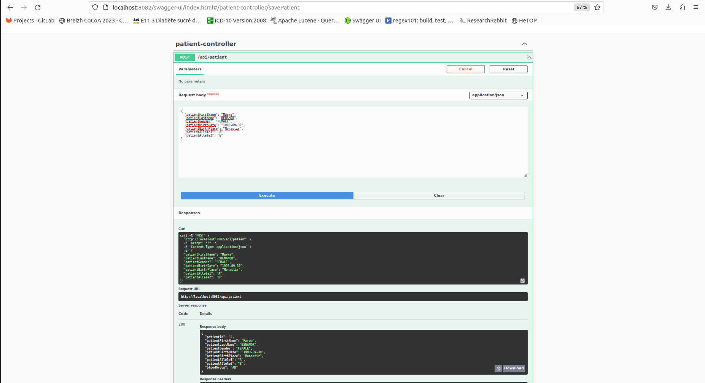
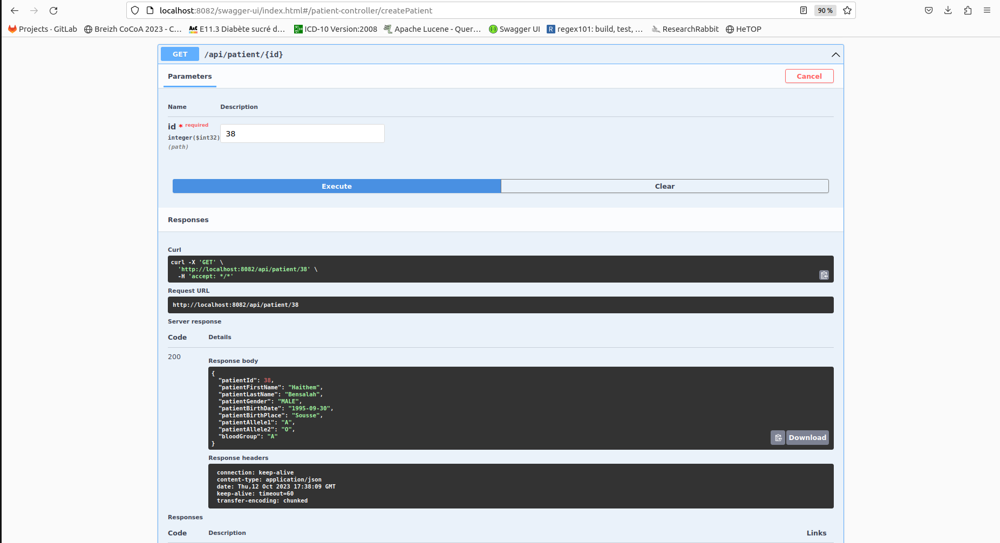
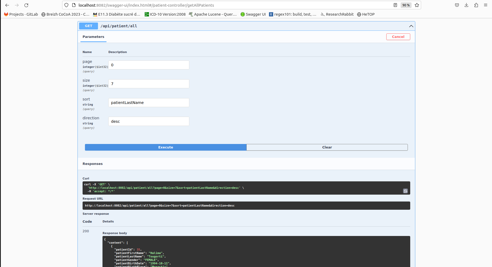
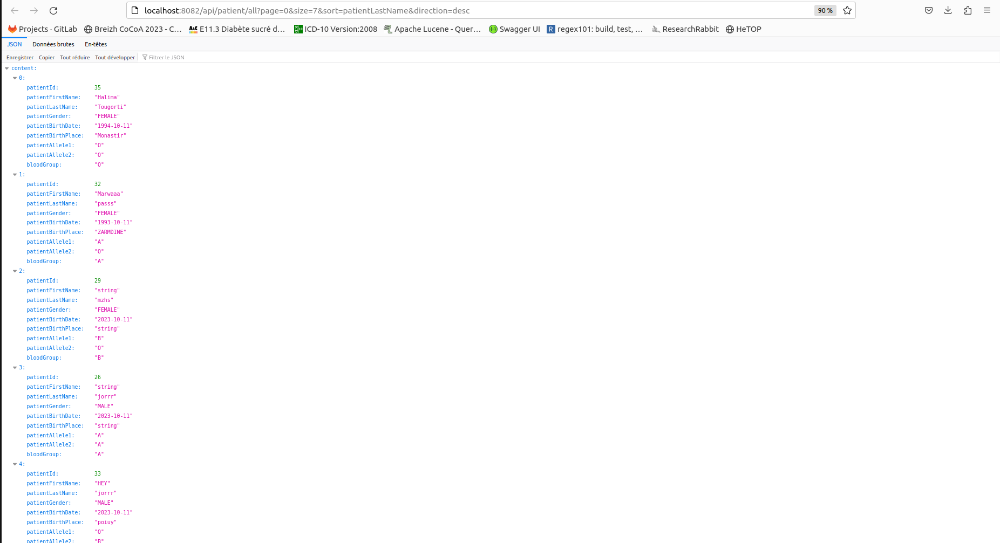
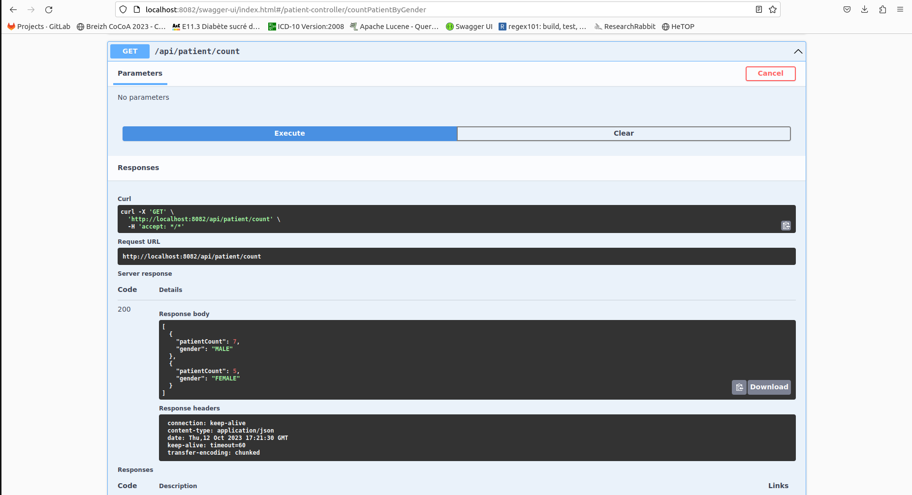
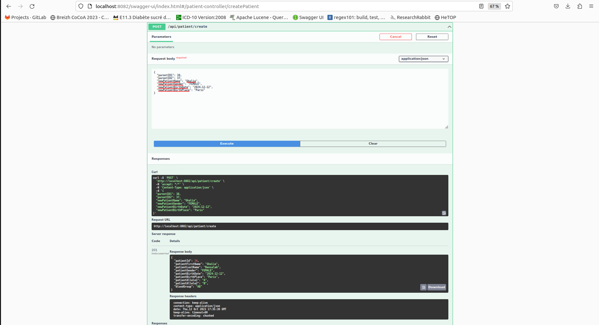

# Projet d'Examen INF201 : Application Java de Gestion de Patients

Ce projet consiste en la création d'une application Java avec Spring Boot pour la gestion de patients. L'application permet d'enregistrer de nouveaux patients, de récupérer des informations sur des patients existants, de compter les patients par genre, et de créer de nouveaux patients basés sur les données de leurs parents.

## Instructions d'Installation

1. Clonez ce dépôt :
git clone https://github.com/votre-utilisateur/examen-inf201.git 
2. Accédez au répertoire du projet : cd examen-inf201
3. Ouvrez le projet avec un editeur de texte (IntelliJ par exemple)
4. Configurez le fichier `application.properties.example` : Assurez-vous de configurer le fichier `application.properties` pour définir les paramètres de connexion à la base de données PostgreSQL. Vous devrez spécifier la base de données à laquelle l'application se connectera, le nom d'utilisateur utilisé pour la connexion et le mot de passe associé. 
5. Enregistrez les modifications dans le fichier `application.properties`.
6. Exécutez l'application Spring Boot :
- http://localhost:8082/swagger-ui.html

## Spécifications des API

- **Enregistrer un patient**

 *Chemin : `/api/patient`

 *Méthode :POST
 
 *Paramètres d'entrée : un DTO, qui contient les caractéristiques du patient que l'on cherche à créer, sans son ID. Le DTO devra être annoté avec un @RequestBody.

 *Paramètre de sortie : un patient

- **Récupérer les données d'un patient**

   *Chemin : `/api/patient/{id}`
   
   *Méthode : GET

   *Paramètres d'entrée : un ID. L'ID devra être annotée avec une @PathVariable.

   *Paramètre de sortie : un patient

- **Récupérer les données de tous les patients de manière paginée**
   *Chemin : `/api/patient/all`
   
   *Méthode : GET

   *Paramètres d'entrée : une Pageable de Spring.

   *Paramètre de sortie : une Page de patients

 

- **Compter l'ensemble des patients par genre**

   *Chemin : `/api/patient/count`
   
   *Méthode : GET

   *Paramètres d'entrée : aucun

   *Paramètre de sortie : le résultat du dénombrement, par genre

- **Créer un nouveau patient sur la base des ID de deux patients déjà enregistrés dans la base**

    *Chemin : `/api/patient/create`

    *Méthode : POST

    *Paramètres d'entrée : un DTO qui contient l'ID des deux parents, ainsi que les caractéristiques propres au patient que l'on cherche à créer (hors groupage ABO dont la logique métier est codée en Java)

    *Paramètre de sortie : un patient (celui qui a été créé).

## Persistance des Données

Les données sont stockées dans une base de données PostgreSQL dans le schéma `exam_inf201`.

## Contact

Pour toute remarque, contacte-moi Romain.

## Remerciements

Je te remercie pour ton aide à la réalisation de ce projet.
